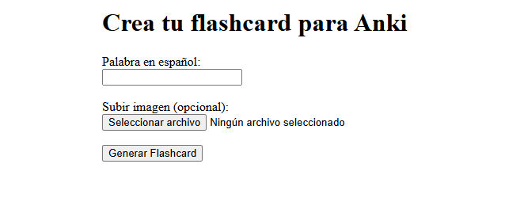

<p align="center">
  
</p>

# Generador de Flashcards para Anki

Este proyecto es una aplicación web desarrollada en Python que permite a los usuarios crear flashcards de vocabulario para Anki. El usuario ingresa una palabra en español, y la aplicación genera automáticamente una tarjeta con la traducción al inglés, un archivo de audio en inglés, una oración de ejemplo del diccionario de Cambridge y, opcionalmente, una imagen personalizada subida por el usuario. El resultado es un archivo `.apkg` compatible con Anki.

https://www.youtube.com/watch?v=Gnpe9flQia4&feature=youtu.be

## Características

- **Traducción automática**: Convierte palabras de español a inglés usando `deep-translator`.
- **Audio en inglés**: Genera pronunciación en inglés con `gTTS` (Google Text-to-Speech).
- **Oración de ejemplo**: Extrae una oración en inglés del diccionario de Cambridge mediante web scraping.
- **Imagen personalizada**: Permite al usuario subir una imagen para asociarla con la palabra.
- **Formato Anki**: Exporta las tarjetas en un archivo `.apkg` listo para importar en Anki.
- **Sin dependencias pesadas**: No requiere `torch` ni frameworks de machine learning.

## Requisitos

* Python 3.7 o superior
* Dependencias de Python (listadas abajo)

## Instalación

1. **Clona o descarga este repositorio:**
   ```bash
   git clone https://github.com/andreyali/calculadoraPAM.git
   cd calculadoraPAM
   ```

2. **Crea un entorno virtual:**

  ```bash
  python -m venv venv
  # En Windows: venv\Scripts\activate
  ```

3. Instala las dependencias necesarias:

  ```bash
  pip install flask requests beautifulsoup4 gtts genanki deep-translator
  ```

* Asegúrate de tener una carpeta templates con el archivo index.html

## Estructura del proyecto 

<nombre_del_proyecto>/
├── app.py       # Código principal de la app
├── templates/
│ └── index.html # Interfaz web
├── static/
│ ├── audio/     # Carpeta para archivos de audio generados
│ └── images/    # Carpeta para imágenes subidas
└── README.md    # Este archivo

##Contenido de index.html
 
* Crea un archivo templates/index.html con el siguiente contenido:

<!DOCTYPE html>
<html>
<head>
    <title>Generador de Flashcards</title>
</head>
<body>
    <h1>Crea tu flashcard para Anki</h1>
    <form method="post" enctype="multipart/form-data">
        <label>Palabra en español:</label><br>
        <input type="text" name="palabra" required><br><br>
        <label>Subir imagen (opcional):</label><br>
        <input type="file" name="imagen" accept="image/*"><br><br>
        <input type="submit" value="Generar Flashcard">
    </form>
</body>
</html>


## Uso

1. **Ejecutar la aplicación:**
```bash
    python project.py
    ```

2. **Abre tu navegador y ve a:**

 `http://127.0.0.1:5000/`

3. **Ingresa una palabra en español** (ej. "gato"), sube una imagen opcional y haz clic en "Generar Flashcard".

4.**Descarga el archivo .apkg generado y ábrelo con Anki para importar la tarjeta.**

## Ejemplo

1. Entrada: Palabra: "perro", Imagen: (opcional)
2. Salida: 
3. Frente: "perro"
4. Reverso: "dog", audio de "dog", oración como "The dog barked at the stranger", imagen (si se subió).

## Notas

1. Scraping: La obtención de oraciones depende del diccionario de Cambridge. Si el sitio cambia su estructura o bloquea solicitudes, las oraciones podrían fallar (se usa un respaldo en ese caso).

2. Audio: El audio se genera en inglés usando gTTS, asegurando pronunciación correcta.

3. Limitaciones: Los archivos de audio e imágenes se sobrescriben si las palabras en inglés son idénticas. Considera añadir un timestamp si necesitas evitar esto.

## Dependencias

**flask:** Framework web.
**requests:** Para solicitudes HTTP.
**beautifulsoup4:** Para web scraping.
**gtts:** Para generar audio.
**genanki:** Para crear archivos .apkg.
**deep-translator:** Para traducciones confiables.

## Contribuir
Si quieres mejorar este proyecto, siéntete libre de abrir un pull request o reportar problemas en el repositorio.

## Licencia
Este proyecto está bajo la licencia MIT.

## Autor
Creado por Alba Alvarez